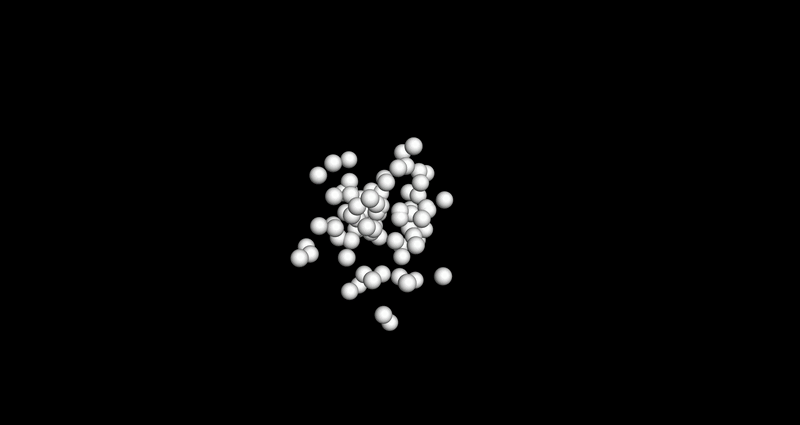
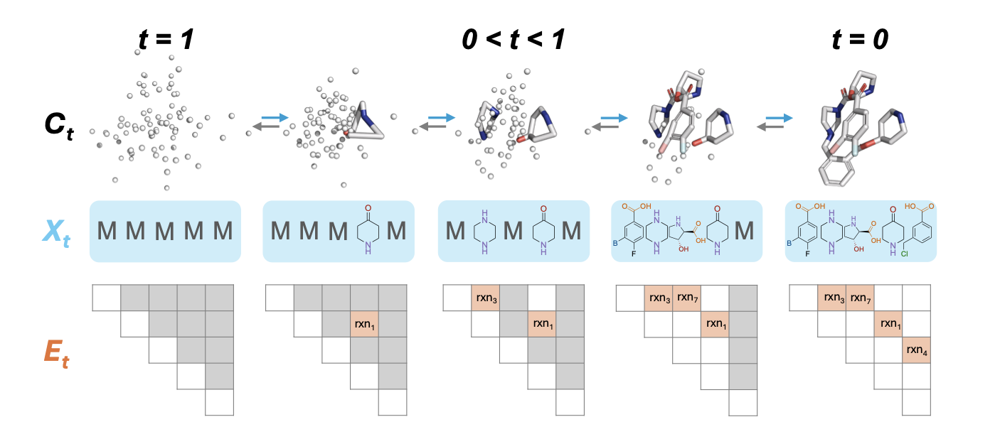

<p align="center">
  
</p>

## SynCoGen
**Syn**thesizabile **CoGen**eration (**SynCoGen**) is a generative small molecule design framework comprised of simultaneous absorbing state discrete diffusion model and continuous flow matching. The discrete diffusion model is based on [Simple and Effective Masked Diffusion Language Models](https://arxiv.org/pdf/2406.07524) for synthesizable molecular generation, based on [this repo](https://github.com/kuleshov-group/mdlm) and using the SUBS parametrization. The continuous flow matching model is a straightforward implementation of conditional flow matching over molecular coordinates. We provide a simple graph transformer as a backbone.

<p align="center">
  
</p>

Rather than operate on sequences, SynCoGen's discrete component operates on graphs. Masking is performed on both node (B x N x D) and edge (B x N x N x D) matrices.

### Chemistry
The purpose of SynCoGen is to generate molecules with valid synthesis paths. To this end, we define a "vocabulary" by a compatible set of building blocks and reaction templates from which to generate synthesizable molecules via combinatorial synthesis using RDKit. Conformers are then generated for these molecules using GFN-xTB. Upon validation end, we evaluate all sampled molecules by their validity according to RGFN's reaction rules.

### Graph Parametrization
Node and edge identities are encoded as onehot vectors. The dimensionality of the node onehot vector is simply the number of fragment types. The dimensionality of the edge onehot vector is (R x C^2) where R is the number of reaction types and C is the number of centers in the reaction. Both reaction type and center indices are encoded to define generated molecules are strictly as possible, such that a graph sampled by SynCoGen corresponds to a valid molecule with no structural ambiguity.

### Coordinate Parametrization
We use continuous flow matching to predict the coordinates of the atoms in the molecule. Ground-truth and predicted coordinates are given by a (B x N x MAX_ATOMS x 3) tensor, where MAX_ATOMS is the maximum number of atoms in any of the fragments in the vocabulary. During loss calculation, we only consider the atoms in the molecule, and ignore the dummy atoms used to pad the fragments as well as the atoms that are dropped during reactions. During sampling, we first reassemble the fragments into an RDKit molecule using the predicted graph, and then use the number of atoms attributed to each fragment to determine a final molecule mask. The remaining coordinates are assigned to the molecule and an SDF file is generated.

### Data Generation
See vocabulary/README.md.

The full SynSpace dataset is available [here](https://tyers.s3.us-west-1.amazonaws.com/all_steps_clean.tgz). For SynSpace, download all_steps_clean.tgz. For pharmacophores, download pharmacophores.lmdb. An LMDB version of SynSpace conformers will be uploaded soon.

### Directory Structure
```
SynCoGenRW/
├─ train.py
├─ configs/
│  ├─ experiments/          # Complete experiment configurations
│  ├─ training/            # Training and diffusion base configs
│  ├─ model/               # Model architecture configs
│  ├─ noise/               # Noise schedule configs
│  ├─ loss/                # Loss function configs
│  ├─ optim/               # Optimizer configs
│  ├─ scheduler/           # Learning rate scheduler configs
│  ├─ sampling/            # Sampling strategy configs
│  └─ logging/             # Logging, callbacks, and metrics configs
├─ syncogen/
│  ├─ api/
│  │  ├─ atomics/          # Atomic-level operations (coordinates, masks, pharmacophores)
│  │  ├─ graph/            # Graph representations (building blocks, reactions)
│  │  ├─ ops/              # Graph and coordinate operations
│  │  └─ rdkit/            # RDKit integration for molecule assembly
│  ├─ constants/           # Constants and vocabulary loading utilities
│  ├─ data/                # Data loading and preprocessing
│  ├─ diffusion/
│  │  ├─ interpolation/    # Interpolation schemes for flow matching
│  │  ├─ loss/             # Loss function implementations
│  │  ├─ noise/            # Noise schedule implementations
│  │  ├─ sampling/         # Sampling strategies and integrators
│  │  └─ training/         # Training loop and optimizer wrappers
│  ├─ logging/               # Logging infrastructure (callbacks, loggers, metrics)
│  ├─ models/             # Model architectures (SEMLA, SEMLA-Pharm)
│  └─ utils/              # Utility functions (file I/O, RDKit helpers)
└─ vocabulary/            # Vocabulary directories (building blocks, reactions)
```

### Configuration with Gin

SynCoGen uses [Gin-config](https://github.com/google/gin-config) for experiment configuration. Gin is a lightweight configuration framework that allows you to configure Python classes and functions through simple text files, making it easy to manage complex experiments without modifying code.

Classes and functions decorated with `@gin.configurable` can have their parameters set via `.gin` files. When you instantiate these objects, Gin automatically injects the configured values.

**Config structure**: The `configs/` directory is organized hierarchically:
- **`experiments/`**: Complete experiment configs that include and compose other configs
- **Component configs**: Modular configs for specific components (noise schedules, losses, models, etc.)
- **Base configs**: Shared defaults in `training/base.gin`

**Creating custom configs**: Start with an existing experiment config and modify parameters, or compose new configs by including base configs and component configs. See `configs/README.md` for detailed documentation on the Gin configuration system. 

### Getting Started

Create the environment with conda:
```bash
module load cuda/12.4.0   # on cluster
conda env create -f requirements.yaml
conda activate syncogen
```

### Training
To start a training run on SynSpace with pharmacophore conditioning, run:
```bash
python train.py --config configs/experiments/synspace_original_cond.gin --vocab_dir vocabulary/original
```

### Sampling
We provide weights for both unconditional and conditional sampling: [here](https://us-west-1.console.aws.amazon.com/s3/object/tyers?region=us-west-1&prefix=synspace_original_uncond.ckpt) and [here](https://us-west-1.console.aws.amazon.com/s3/object/tyers?region=us-west-1&prefix=synspace_original_cond.ckpt), respectively.

For unconditional 3D molecule generation:
```bash
python run_sampling_uncond.py \
    --config configs/experiments/synspace_original_uncond.gin \
    --checkpoint_path <path_to_unconditional_checkpoint> \
    --vocab_dir vocabulary/original \
    --output_dir samples/synspace_original_uncond_${TIMESTAMP} \
    --batch_size 100 \
    --num_batches 1 \
    --num_steps 100
```

For conditional sampling with pharmacophore constraints (setup):
```bash
python run_sampling_cond.py \
    --config configs/experiments/synspace_original_cond.gin \
    --checkpoint_path <path_to_conditional_checkpoint> \
    --vocab_dir vocabulary/original \
    --reference_ligand <path_to_reference.sdf> \
    --output_dir samples/synspace_original_cond_${TIMESTAMP} \
    --batch_size 100 \
    --num_batches 1 \
    --num_steps 100 \
    --gin "Diffusion.num_fragments_probs = {3: 1.0, 4: 0.0, 5: 0.0}" \
    --pharm_subset 7
```

**Sampling arguments**:
- `--checkpoint_path`: Path to the trained model checkpoint (`.ckpt` file)
- `--vocab_dir`: Directory containing the vocabulary (building blocks and reactions)
- `--output_dir`: Directory where generated SDF files will be saved
- `--batch_size`: Number of molecules to generate
- `--num_steps`: Number of diffusion steps for sampling (typically 100-200)
- `--reference_ligand` (conditional only): Path to reference ligand SDF file for pharmacophore extraction
- `--pharm_subset` (conditional only): Number of pharmacophores to use for conditioning (default: 7)

**Note**: The provided checkpoints were trained to use 7 random pharmacophores for conditional sampling. For unconditional sampling, omit the `--reference_ligand` and `--pharm_subset` arguments.