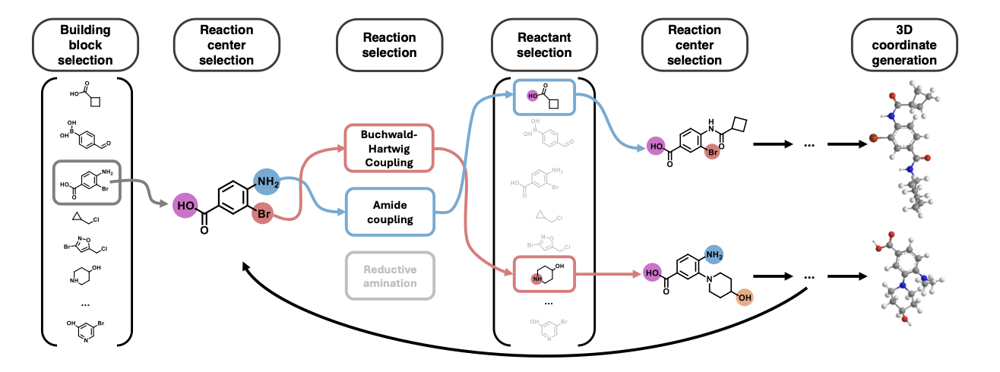

<p align="center">
  
</p>

# Vocabulary Preprocessing

The `preprocess.py` script processes building blocks and reaction templates to create a vocabulary for SynCoGen. It performs annotation, compatibility checking, filtering, and feature computation.

## Usage

```bash
python preprocess.py --bb_input <path> --rxn_input <path> --output_dir <path> [options]
```

## Required Arguments

### `--bb_input`
- **Type**: `str`
- **Required**: Yes
- **Description**: Path to the building blocks input file
- **Formats**: 
  - Text file (`.txt` or `.smi`): One SMILES string per line
  - CSV file (`.csv`): Requires `--bb_smiles_column` to specify the column containing SMILES
- **Example**: `--bb_input building_blocks.txt` or `--bb_input building_blocks.csv`

### `--rxn_input`
- **Type**: `str`
- **Required**: Yes
- **Description**: Path to the reaction templates input file
- **Formats**:
  - Text file (`.txt`): One SMARTS reaction template per line
  - CSV file (`.csv`): Requires `--rxn_smarts_column` to specify the column containing SMARTS
- **Example**: `--rxn_input reactions.txt` or `--rxn_input reactions.csv`

### `--output_dir`
- **Type**: `str`
- **Required**: Yes
- **Description**: Directory where all output files will be written
- **Note**: The directory will be created if it doesn't exist
- **Example**: `--output_dir ./vocab_output`

## Optional Arguments

### `--bb_smiles_column`
- **Type**: `str`
- **Default**: `None`
- **Description**: Column name in CSV building-block file containing SMILES strings
- **Required when**: `--bb_input` is a CSV file
- **Example**: `--bb_smiles_column smiles` or `--bb_smiles_column SMILES`

### `--rxn_smarts_column`
- **Type**: `str`
- **Default**: `None`
- **Description**: Column name in CSV reaction file containing SMARTS reaction templates
- **Required when**: `--rxn_input` is a CSV file
- **Example**: `--rxn_smarts_column reaction_smarts` or `--rxn_smarts_column SMARTS`

### `--keep_incompatible`
- **Type**: `flag` (no value)
- **Default**: `False`
- **Description**: If set, keeps building blocks and reactions that have no compatible reaction centers. By default, incompatible items are filtered out.
- **Example**: `--keep_incompatible`

### `--max_centers_per_bb`
- **Type**: `int`
- **Default**: `3`
- **Description**: Maximum number of reaction centers per building block stored in the compatibility tensor. Building blocks with more centers will have the extra centers ignored (with a warning).
- **Example**: `--max_centers_per_bb 5`

### `--diverse_subset`
- **Type**: `int`
- **Default**: `None`
- **Description**: If specified, uses MaxMinPicker to select this many diverse building blocks from the property-filtered BBs before compatibility computation. This helps reduce the vocabulary size while maintaining chemical diversity.
- **Note**: Only applied if the value is less than the number of filtered building blocks
- **Example**: `--diverse_subset 1000`

### `--max_atoms_per_bb_filter`
- **Type**: `int`
- **Default**: `16`
- **Description**: Maximum number of atoms allowed per building block. Building blocks exceeding this limit are filtered out during property-based filtering.
- **Note**: Only applied if `--no_property_filtering` is not set
- **Example**: `--max_atoms_per_bb_filter 20`

### `--allowed_atom_types`
- **Type**: `str`
- **Default**: `"C,N,O,B,F,Cl,Br,S"`
- **Description**: Comma-separated list of allowed atom symbols for building blocks. Building blocks containing other atom types are dropped.
- **Note**: Only applied if `--no_property_filtering` is not set
- **Example**: `--allowed_atom_types "C,N,O,F,Cl"`

### `--n_threads`
- **Type**: `int`
- **Default**: `8`
- **Description**: Number of threads to use for fingerprint generation during diverse picking (when `--diverse_subset` is specified).
- **Example**: `--n_threads 16`

### `--no_property_filtering`
- **Type**: `flag` (no value)
- **Default**: `False`
- **Description**: If set, skips property-based filtering of building blocks. Property filtering includes:
  - Removal of disjoint fragments (SMILES containing '.')
  - Sanitization and canonicalization
  - Deduplication
  - Atom count filtering (`--max_atoms_per_bb_filter`)
  - Atom type filtering (`--allowed_atom_types`)
- **Example**: `--no_property_filtering`

### `--no_substructure_filtering`
- **Type**: `flag` (no value)
- **Default**: `False`
- **Description**: If set, skips unwanted substructure filtering. By default, building blocks containing PAINS (A, B, C), Brenk, or NIH unwanted substructures are filtered out.
- **Example**: `--no_substructure_filtering`

## Processing Pipeline

The script performs the following steps in order:

1. **Reaction Annotation**: Annotates reaction templates with reaction center information
2. **Building Block Loading**: Loads building blocks from the input file
3. **Property Filtering** (optional): Filters BBs by properties (atom count, atom types, sanitization)
4. **Substructure Filtering** (optional): Removes BBs with unwanted substructures (PAINS, Brenk, NIH)
5. **Diverse Subset Selection** (optional): Selects a diverse subset of BBs using MaxMinPicker
6. **Compatibility Computation**: Builds compatibility tensor between BBs and reactions
7. **BB Filtering**: Removes BBs without reaction centers (unless `--keep_incompatible`)
8. **Reaction Filtering**: Removes reactions incompatible with all BBs (unless `--keep_incompatible`)
9. **Feature Computation**: Computes fragment-level features (MACCS fingerprints, atom features, bond features)
10. **Output Writing**: Writes all output files

## Output Files

The script generates the following files in `--output_dir`:

- **`building_blocks.json`**: Mapping of SMILES to reaction center indices
- **`reactions.json`**: Mapping of SMARTS to reaction metadata (drop_bools, index)
- **`compatibility.pt`**: PyTorch tensor of shape `(n_bbs, n_rxns, max_centers)` indicating compatibility
- **`fragment_features.pt`**: PyTorch tensor containing fragment-level features (MACCS, atom features, bond features, adjacency)
- **`smiles_annotated.json`**: Building block annotations (reaction center indices)
- **`templates_annotated.json`**: Reaction template annotations (reaction center information)
- **`meta.json`**: Metadata including counts, dimensions, atom types, etc.

## Example

```bash
python preprocess.py \
  --bb_input data/building_blocks.csv \
  --bb_smiles_column SMILES \
  --rxn_input data/reactions.txt \
  --output_dir vocab_output \
  --max_centers_per_bb 5 \
  --max_atoms_per_bb_filter 20 \
  --allowed_atom_types "C,N,O,F,Cl,Br" \
  --diverse_subset 5000
```

---

# Graph Data Generation

The `generate_graph_data.py` script samples random molecules by building fragment graphs from a preprocessed vocabulary. It generates molecular graphs compatible with SynCoGen's training pipeline and optionally computes conformers.

## Usage

```bash
python generate_graph_data.py --compat_path <path> [options]
```

## Required Arguments

### `--compat_path`
- **Type**: `str`
- **Required**: Yes
- **Description**: Path to the compatibility tensor file (`.pt`) generated by `preprocess.py`
- **Default**: `vocabulary/compatibility.pt`
- **Example**: `--compat_path vocabulary/original/compatibility.pt`

## Optional Arguments

### `-n, --num_samples`
- **Type**: `int`
- **Default**: `100`
- **Description**: Number of molecules to sample
- **Example**: `--num_samples 1000`

### `-l, --length`
- **Type**: `int` or `list[int]`
- **Default**: `2`
- **Description**: Length(s) of molecules in fragments. If multiple values are provided, a random one is chosen for each molecule
- **Example**: `--length 2` or `--length 2 3 4`

### `--save_graphs`
- **Type**: `flag` (no value)
- **Default**: `False`
- **Description**: If set, saves generated molecules as PyTorch Geometric graph objects
- **Example**: `--save_graphs`

### `--output_dir`
- **Type**: `str`
- **Default**: `data/molecule_graphs`
- **Description**: Directory to save generated molecule graphs
- **Note**: Only used when `--save_graphs` is set
- **Example**: `--output_dir data/graphs`

### `--seed`
- **Type**: `int`
- **Default**: `None`
- **Description**: Random seed for reproducibility
- **Example**: `--seed 42`

### `--sample_by_inverse_molwt`
- **Type**: `flag` (no value)
- **Default**: `False`
- **Description**: If set, samples building blocks inversely proportional to their molecular weight
- **Example**: `--sample_by_inverse_molwt`

### `--molwt_temperature`
- **Type**: `float`
- **Default**: `1.0`
- **Description**: Temperature for molecular weight sampling. Higher values yield more uniform sampling, lower values yield more peaked distributions
- **Example**: `--molwt_temperature 0.5`

### `--save_conformers`
- **Type**: `flag` (no value)
- **Default**: `False`
- **Description**: If set, generates and saves conformers for sampled molecules
- **Example**: `--save_conformers`

### `--num_conformers`
- **Type**: `int`
- **Default**: `50`
- **Description**: Number of conformers to generate per molecule
- **Note**: Only used when `--save_conformers` is set
- **Example**: `--num_conformers 100`

### `--energy_cutoff`
- **Type**: `float`
- **Default**: `10.0`
- **Description**: Energy cutoff in kcal/mol for conformer filtering
- **Example**: `--energy_cutoff 5.0`

### `--rmsd_threshold`
- **Type**: `float`
- **Default**: `1.5`
- **Description**: RMSD threshold in Angstroms for conformer clustering
- **Example**: `--rmsd_threshold 2.0`

### `--conformer_dir`
- **Type**: `str`
- **Default**: `data/conformers`
- **Description**: Directory to save conformers
- **Note**: Only used when `--save_conformers` is set
- **Example**: `--conformer_dir data/conformers`


### `--xtb` (NOT IMPLEMENTED)
- **Type**: `flag` (no value)
- **Default**: `False`
- **Description**: If set, runs XTB optimization on molecules and saves conformers
- **Example**: `--xtb`

## Generation Process

The script performs the following steps:

1. **Load Compatibility Tensor**: Loads the compatibility tensor from `--compat_path`
2. **Sample Molecules**: Randomly samples molecules by building fragment graphs using compatible building blocks and reactions
3. **Lipinski Filtering**: Applies Lipinski's rule of five constraints during sampling (molecular weight, H-bond donors, H-bond acceptors)
4. **Property Calculation**: Computes molecular properties (MW, LogP, HBD, HBA, QED) for generated molecules
5. **Conformer Generation** (optional): Generates conformers using RDKit or XTB optimization
6. **Output**: Saves graph data and/or conformers if requested

## Output

When `--save_graphs` is set, the script saves:
- **`dataset_list_full.pt`**: List of PyTorch Geometric `Data` objects containing molecular graphs compatible with SynCoGen's training pipeline

The script also prints averaged molecular property statistics (MW, LogP, HBD, HBA, QED) for all generated molecules.

## Example

```bash
python generate_graph_data.py \
  --compat_path vocabulary/original/compatibility.pt \
  --num_samples 1000 \
  --length 2 3 4 \
  --save_graphs \
  --output_dir data/graphs \
  --seed 42 \
  --sample_by_inverse_molwt
```

